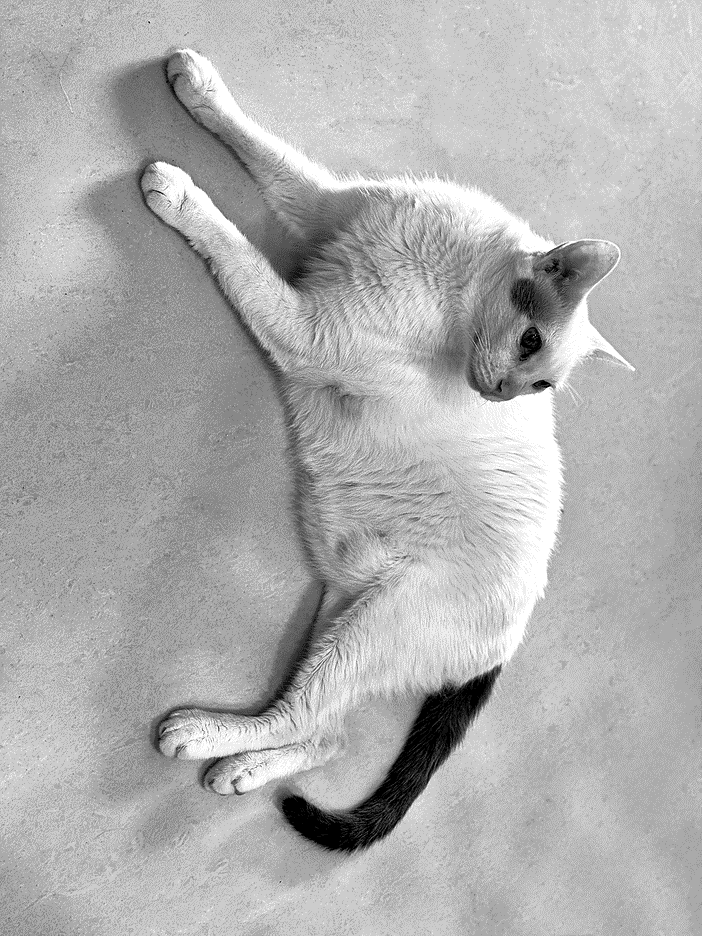
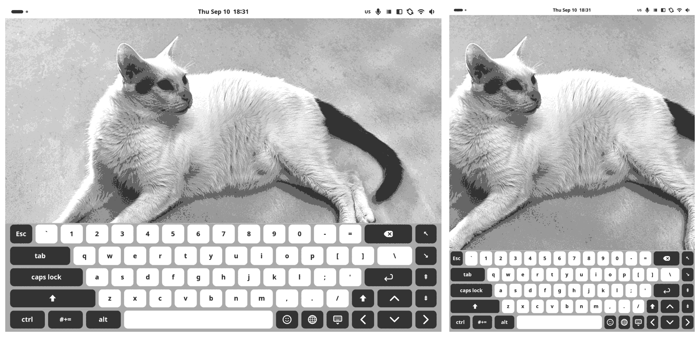

# pinenote

> **Everything CVER runs on the Pine64 PineNote.** The settings and three GNOME extensions
> that make a Debian/GNOME image behave on e-ink — and, at more length, what each of them
> cost to get wrong first.

[](LICENSE)


---

## What & why

The PineNote ships a Debian/GNOME image that drives the e-ink panel as though it were an
ordinary display. Nothing is broken and almost every default is wrong for the panel: the
partial-refresh waveform is the one the kernel source itself annotates as "flashy", and it
is applied to every keystroke.

Most of what follows hangs off one button. The tone control switches between two modes, and
each carries a waveform, and the waveform decides what happens to ghosting:

| Mode | Waveform | Ghosting | Ink | Clearing |
|---|---|---|---|---|
| Greyscale — the default | GC16 | never accumulates: every update resets as it draws | faint, because a pen outruns a 450ms waveform | not needed |
| Black and white | A2 | accumulates | keeps up with the pen | scheduled |

Neither is the better one. They are two tasks — reading and writing — and the trade only
resolves once you know which you are doing, which is why this is a button rather than a
setting somebody picks once.

Where clearing is needed it does not have to be a flash. Driving every pixel to both rails
and changing the brightness of the whole field at once are separable, and only the second is
unpleasant: a complementary dither gives every pixel the same swing the stock flash does
while the screen's mean luminance never leaves mid grey. Thirty-two of those fired here in
one evening without being noticed.

The rest of this file is mostly the measurements that got there, including the ones that
were wrong for a while.

## setup/

One line on a clean PineNote:

```sh
curl -sL https://raw.githubusercontent.com/CVERInc/pinenote/main/setup/bootstrap.sh | bash
```

It is idempotent, and it installs:

- **Typing mode** — A2 waveform, dithered B/W (icons keep their shading), `auto_refresh` off,
  persisted via `/etc/modprobe.d/rockchip_ebc.conf` and a systemd user service.
- **Idle refresh** — a small daemon that watches GNOME's idle monitor and clears the screen
  once you have been still for 8 seconds. The clear itself is `pn-wave`'s complementary
  dither rather than the stock flash; see *The clear you do not see*.
- **The clear** — `extensions/pn-wave@cver.net` installed and enabled, and the kernel's own
  `auto_refresh` turned off at the setting that actually owns it.
- **The keyboard** — `extensions/pn-osk@cver.net` installed and enabled, with
  `pn-osk.example.json` dropped in as `~/.config/pn-osk.json` if you do not have
  one yet. An existing config is never overwritten.
- **The panel** — `extensions/pn-panel@cver.net` installed and enabled. Separate
  from the keyboard on purpose; see *The panel it taps*.
- **Input methods** — `setup/ime.sh`, run by `setup.sh` unless `PINENOTE_NO_IME=1`.
  Pinyin and bopomofo that output traditional, Japanese by romaji, Korean
  installed but left out of the switching list; see *The languages it types in*.
- **Terminal legibility** — pure black on pure white, no cursor blink, a large monospace face,
  and a sixteen-slot ANSI palette split into marks and plates; see *The agent it codes with*.
- **A guard on `pinenote-dbus-service`** — without it the whole clearing half can die silently;
  see *When the ghosting stops clearing* below.
- **A sleep screen** — optional, and only if you have put a `~/offscreen/screen.bin` there.
  Installed as firmware and re-applied at every boot by `pn-offscreen.service`, because the
  firmware path alone does not survive a reboot; see *The picture it sleeps under* below.
- **Lifelines** — SSH enabled, idle suspend disabled, GNOME's shell and mutter held back (what
  is actually documented on this device is a full `dist-upgrade` leaving it with no gdm3 — not
  a fault in any one GNOME release), and `setup/lifeline.sh` below.

Everything is plain bash and gsettings. Read `setup/setup.sh` top to bottom before you run it.

### When the ghosting stops clearing

Half of this design is *not clearing* while you type. That half never breaks loudly — so when
the other half dies, the symptom is simply a screen that slowly becomes unreadable, with no
error anywhere you would think to look. Both halves of that failure happened here, and both
were silent for days:

1. **`pinenote-dbus-service` panics at boot.** It reads
   `/sys/devices/platform/gpio-keys/power/wakeup` while checking travel mode, and `gpio-keys`
   (the magnetic cover switch) can lose a boot-time race with its GPIO controller:

   ```
   gpio-keys gpio-keys: error -ENXIO: Unable to get irq number for GPIO 0
   ```

   A device that never probed has no `power/wakeup`, so the service exits 101 and
   `org.pinenote.ebc` never reaches the bus — and `TriggerGlobalRefresh` has no listener.
   Rebinding after boot always works, which is what the drop-in in `setup/` does.

2. **The idle daemon parsed its own input wrong.** GNOME's idle monitor answers
   `(uint64 342896,)`, and a `grep -oE '[0-9]+'` over that returns **two** numbers — the `64`
   in `uint64` first. Every comparison then failed with *integer expression expected*, roughly
   174,000 times per boot, straight into the journal. The refresh never fired once.

If ghosting stops clearing, check these in order:

```sh
systemctl status pinenote-dbus-service          # exit 101 => the gpio-keys race
journalctl --user -u pn-idle-refresh -b         # the daemon now says so when it cannot refresh
pn_trigger_global_refresh                       # does a manual clear still work?
```

The general lesson is worth more than either bug: **a component whose job is to stay quiet
needs to be loud when it fails.** The evidence for both was sitting in the journal the entire
time. Nobody had a reason to look, because nothing ever said anything was wrong.

### setup/lifeline.sh

The five settings that decide whether you can service this device from another machine at
all. They are separate because three of them need something only you can supply, and one of
them is a security trade-off nobody should inherit silently.

| | Needs | Default |
|---|---|---|
| Persistent journal | nothing | **applied** — stock journald is volatile, so the log of a crash dies with the crash |
| SSH authorised key | `PINENOTE_SSH_PUBKEY` | skipped |
| Wi-Fi connection | `PINENOTE_WIFI_SSID`, `PINENOTE_WIFI_PSK` | skipped |
| Passwordless sudo | `PINENOTE_NOPASSWD_SUDO=1` | skipped — read the block first |
| Wi-Fi powersave off | nothing | **applied** — see below |

Three findings worth keeping even if you write your own:

- On a **WPA2/WPA3 transition** network, nmcli's shorthand and an explicit `sae` both fail to
  associate. It has to be `wifi-sec.key-mgmt wpa-psk`.
- `nmcli connection add` **over SSH** fails with *Insufficient privileges* — polkit grants
  NetworkManager writes to an active local session, and an SSH login is not one. Use `sudo`,
  which is the better answer regardless: a root-owned system connection comes up at boot
  without waiting for a login.
- **The tablet says it is connected and answers nothing.** It shows the same IP, but another
  machine cannot even get an ARP reply — and ARP is layer two, so that rules out routing,
  firewalls and a changed address in one go. The Wi-Fi chip is asleep: the association is
  still there, it just does not respond to unsolicited frames, and any packet it sends
  itself wakes it. Loading a web page on the glass is enough to bring it back. On a device
  whose main use is being maintained over SSH the default is simply wrong, so
  `wifi.powersave = 2` goes into `NetworkManager/conf.d`. The block reports
  `iw dev wlan0 get power_save` rather than declaring success, because writing the file
  does not re-apply it to an association that already exists.

  Do not reconnect the interface over SSH to apply it. `nmcli device disconnect` cuts the
  connection you are giving the command through, and nothing runs the second half.

### setup/pn

One command that shows the state of everything this repository added, and
switches the parts that have a switch. It owns no state: each feature's truth
stays where it lives — gsettings, a systemd unit, `~/.config/*.json`, sysfs —
and `pn` is a single door onto all of them. That is also why it reports what
*is* rather than what is configured: Wi-Fi powersave is asked of `iw`, the input
method of `ibus`, the waveform of sysfs. This device has been bitten by the
difference before.

```
pn                          everything, current state
pn wifi off                 typing / idle / osk / panel / wave / k6 / wifi
pn ime add chewing          into the cycle, in tap order — or rm
pn buttons rotate off       any of input / tone / refresh / rotate
pn reload                   restart gdm3, and again if the greeter wins the race
```

`pn buttons` writes `~/.config/pn-panel.json` and bounces the extension; a
button that is off is not built at all rather than built and hidden, because a
hidden button still holds its name in `statusArea` and the child-added guard
keeps re-hiding it. `pn ime add` proved the `sources-changed` path on the
device for the first time: the fourth source got its label and GNOME's own
indicator stayed hidden, with no restart.

### The picture it sleeps under

The PINE64 still life you are left staring at after you press lock is not a GNOME lock screen,
and the setting that looks like it should change it does nothing: `org.gnome.desktop.screensaver
picture-uri` is a dead key — GNOME Shell reads only `user-switch-enabled` out of that schema.
The lock screen's *own* background is your desktop wallpaper with a blur of radius 90 and
brightness 0.65 hardcoded in `unlockDialog.js`, which on e-ink is a field of grey noise.

The still life comes from a layer below all of that. As the panel powers down the EBC driver
pushes `/lib/firmware/rockchip/rockchip_ebc_default_screen.bin` straight at the controller —
1872x1404, 4 bits per pixel, two pixels to a byte, exactly 1,314,144 of them. It is 1:1 with
the physical pixels: no blur, no clock, no unlock dialog, and it stays there for days, because
the picture survives the power going away. `setup/offscreen/` turns a photograph into one.

Writing that file is not, on its own, enough to change the picture — see the first bullet
below. That took a reboot to find out.



*16 grey levels, Floyd–Steinberg, no blur and no clock, held in landscape. Shown at half size
and re-dithered at that size — scaling an already dithered image is how you get moiré. The
real buffer is 1404x1872, 1:1 with the panel. The maintainer's cat, published at the
maintainer's insistence.*

Four things are worth knowing before you make your own:

- **The file the driver reads is the one in the initramfs.** `rockchip_ebc` is a module packed
  into the initramfs and it probes at t+1.3s, so `request_firmware` is answered from there, not
  from the root filesystem you just wrote to. The initramfs was built with the stock picture in
  it, which means your picture is read exactly never — and nothing tells you, because from the
  driver's side nothing failed. It looks correct for as long as the machine stays up, since the
  runtime call below is what put it on the panel, and it is gone after the next boot. `setup.sh`
  therefore also installs `pn-offscreen.service`, which re-applies the picture through that same
  runtime call once the bus is up. Making the file itself authoritative means regenerating the
  initramfs — `PINENOTE_OFFSCREEN_INITRAMFS=1 setup/setup.sh`, opt-in on purpose, because this
  device's only recovery path is maskrom and an initramfs is a thing you can get wrong.
- **The buffer is stored mirrored.** Upright frame to panel is `-flop -rotate 90`, and the
  stock image is the proof — it only comes back readable through exactly that pair. Verify
  against it rather than reasoning about it; `pnimg.py selftest` re-encodes the stock PNG and
  checks it byte for byte against the stock buffer.
- **You do not have to reboot to look.** `org.pinenote.ebc.SetOfflineScreenFromFileTemporary`
  swaps the picture at runtime. On this device that is not a convenience: every reset path
  ends in the machine losing power, and only the physical button brings it back, so "reboot to
  see whether that brightness was right" costs a person walking over to the desk.
- **Your monitor will lie to you about tone.** 16 levels, and a reflective white that returns
  maybe 40% of the light — an image that looks well separated on a laptop arrives flat and
  grey in the hand. The script prints a distribution instead: median for how grey it is,
  near-white for how much highlight detail got flattened, and p1 for whether anything still
  reads as black. Brightening via the white point and brightening via gamma move different
  numbers, and only one of them costs you the fur.

One quieter trap: dither against the 16 levels the buffer can actually hold (0, 17, ... 255).
Dither to anything else and the encoder quantises a second time, undithered — which turns a
carefully dithered gradient straight back into banding, after you already paid for it.

## The clear you do not see

A full clear on e-paper is a black-and-white flash: every pixel is driven to one rail and then
the other, including the ones that did not change, because the point is to reset the particles
rather than to redraw the image. It works, and on this panel it takes about a second.

`extensions/pn-wave@cver.net` does the same work in a different order. Instead of sending the
whole screen to black and then the whole screen to white, it lays down an ordered dither — half
the pixels black, half white — holds it, and then swaps to the exact complement:

```
frame 1   Bayer 8x8 at 50%, held 700 ms
frame 2   its complement,   held 700 ms
```

Every pixel still goes to both rails under GC16. Pixel for pixel it is the same treatment the
stock flash gives. What changes is that the mean luminance of the screen never moves: it sits at
mid grey for the whole 1.4 seconds. The discomfort of a flash comes from the entire visual field
changing brightness at once, not from the clearing itself, and those two turn out to be
separable. In use you stop noticing the clear happens at all — 32 of them fired in one evening
here without the owner spotting one.

`setup/idle-refresh.sh` calls it 8 seconds after you stop touching the screen. If the extension
is not loaded the daemon says so in the journal and falls back to `TriggerGlobalRefresh`,
because the one thing this daemon must never do is quietly clear nothing.

### Hold each frame long enough or it stains

GC16 is a DC-balanced pulse train. Interrupt it with a new target before it finishes and the
residual charge stays on the pixel, which settles a few levels off. On this panel a black/white
swing needs more than 500 ms; 700–900 ms is safe.

That single fact explains every failed attempt that came before this one. Frames held for 220 ms
or 500 ms left banding, and the banding always looked like a bug in whatever animation was being
tried — wrong geometry, wrong dither, wrong stagger — because the parts of the screen that were
truncated depended on how the work happened to land in frames. Four different theories, one
cause. If an animated clear on this hardware leaves marks, suspect the hold time before
suspecting the drawing.

### The sweep that did not win

`Sweep()` is still in the extension: it divides the screen into bands and runs a complete
black/white/black/white clear in each one, staggered so the boundary travels across the display.
It is closer to what a Kindle does, and it looks good.

It is also slow, and slowness is not neutral. A band cannot start until the previous frame has
finished, so a sweep costs `bands + stages − 1` frames — 6 frames for a coarse one, 20 for a fine
one, which is 5 to 12 seconds. Filmed at 240 fps, a Paperwhite's page-turn wipe takes 0.167 s and
resolves in roughly 40 slices; this panel manages one full swing in 450–700 ms. There is no
parameter that closes that gap, and a clear slow enough to watch reads as weak hardware rather
than as a considered animation.

So the sweep stays available and is not the default:

```sh
gdbus call --session --dest net.cver.PnWave --object-path /net/cver/PnWave \
  --method net.cver.PnWave.Sweep "{'bands': <int32 5>, 'cycles': <int32 1>, 'stepMs': <int32 900>}"
```

### auto_refresh has to be off, and pnhelper owns it

The kernel can clear on its own: `auto_refresh` counts the area repainted and fires once it
reaches `refresh_threshold` screenfuls. That path produces the stock flash, from inside the
driver, where its appearance cannot be changed — so it has to be off for any of this to be
visible.

Turning it off in `/etc/modprobe.d` is not enough. `pnhelper` keeps its own copy of the setting
and writes it back to the driver every time the shell starts, so a value set only in sysfs
survives until the next `restart gdm3` and no longer. `setup.sh` sets the gsetting that actually
owns it.

The cost of that is real and worth stating: with the kernel's area counter off, nothing clears
during continuous scrolling — the idle daemon needs you to stop for 8 seconds. Reading with
natural pauses never notices. A long uninterrupted scroll will accumulate.

## The keyboard it types on

GNOME's on-screen keyboard reserves a band the full width of the monitor and a
third of its height in landscape, then draws the keys inside a container that
preserves the layout's column-to-row ratio and centres whatever it cannot fill.
On this panel the keys got 1207 of 1872 pixels. The top 98 of the band's 468
pixels belong to a word-suggestions strip that a terminal never fills. And the
keys were narrow enough that the terminal layout's own labels ellipsized: `Tab`
rendered as `T…`, `Ctrl` as `C…`, `?123` as `?…`. They were not mystery keys.
They were keys that could not spell their names.



`extensions/pn-osk@cver.net` makes the keys use the band that was already being
paid for, and rebuilds the terminal layout as a 65% keyboard: the digits with
their shifted faces, the punctuation where fingers expect it, an inverted-T, and
a navigation column down the right edge. Portrait gets the same keyboard: one
layout in both orientations is worth more than two tuned ones, and rotating the
tablet no longer moves a key. The modifiers are named in lower case on both — the
words fit once the label size is trimmed, and a key that can spell itself beats a
glyph you have to learn. Escape keeps `⎋` in portrait, where the column is
narrowest. Renames live in `labels` (both orientations) and `portrait.labels`
(upright only), the second layered over the first.

It also adds an Escape key, which the stock terminal layout does not have in any
of its four levels. That gap is [three years old
upstream](https://gitlab.gnome.org/GNOME/gnome-shell/-/merge_requests/2551).

Caps Lock says which state it is in. Pressing it latches the whole shift level —
that part works — but GNOME only ever paints a key as *latched* on the
long-press-Shift path, and the caps key is not in the list that gets told. The
state was real and invisible at once. A `:latched` rule in the stylesheet was
tried first and did nothing, because the pseudo class never arrives. So the key
is named after what it is doing instead: `caps lock` becomes `caps locked`. On a
panel with two colours and no animation, words are the signal that survives.

### On GNOME 48

48 renames every keyboard-specific OSK icon to an `osk-` prefix —
`keyboard-enter-symbolic` becomes `osk-enter-symbolic`, and likewise for shift,
caps lock, hide, layout, emoji and delete. The generic `go-*-symbolic` arrows are
left alone. The extension matches both spellings, so one copy runs on 47 and 48.

Only one of those renames actually mattered, and it is worth knowing why: `enter`
is the single icon behind `_composeLevel`'s `return null`. One failed lookup
dropped the entire layout back to stock while the extension still reported
`ACTIVE`, still answered on D-Bus, still read its config, and composed exactly
zero rows. Nothing in the journal said so. If this keyboard is ever silently the
stock one again, `trace` in the config prints what `_updateLayout` was handed and
whether `_addRowKeys` ever saw a composed row — that is the shortest path back.

The keyboard also sits past the bottom of its band, and it is tempting to file
that under 48. It is not. Measured on both systems: keys are 94 physical pixels
on 47 against 96 on 48, five rows overflow by six either way, and `font-size` is
`1.455em` in both themes. **47 has been overflowing since the first day.** What 48
changed is the scale — rotating the tablet makes it write `scale=2` into
`monitors.xml` — so the same six logical pixels arrive as twelve physical ones
and stop being invisible. `stylesheet.css` trims label and icon, which takes keys
to 92 and the overflow to four, and is also what lets `caps locked` fit its three
columns.

This was first written up the other way round, as *48 enlarges the key font*,
from numbers that looked twice as large on one side — because they were logical
pixels under a 2x scale on one system and physical pixels under 1x on the other.
Two coordinate systems, read as one measurement. Correcting it cost a reboot into
the older install and one more look, which is the practical argument for keeping
that install around: a second system is not only a way back, it is the only
control group this device has.

The gap above the screen edge costs width: `AspectContainer` holds a ratio, so
every pixel taken off the band returns as roughly two pixels of margin on each
side. Loosening `.key-container` padding does not help, and neither does an
explicit `height` — only the font size moves a key's height, and that is a
legibility budget, not a layout knob.

Every width lives in `~/.config/pn-osk.json` and is re-read on each rebuild, so
changing the shape of the keyboard costs a JSON edit and a D-Bus call rather
than a session restart. **Read
[GEOMETRY.md](extensions/pn-osk@cver.net/GEOMETRY.md) before changing one** —
half a column is the smallest width this keyboard can express, and finer values
are truncated without complaint.

The extension also exposes `Capture` and `Geometry` on
`org.cver.PnOsk`. That is not a debugging leftover: GNOME refuses screenshots to
callers outside the shell, and `/dev/fb0` on this device holds whatever plymouth
last drew rather than the live desktop, so there was no way to see this layout
over SSH except by photographing the glass. `setup/oskshot` counts down and then
takes the picture, which leaves your hands free to rotate the tablet or hold
shift while it fires.

### What the measurements could not tell us

The instrumentation found the 17 columns, the 0.5 grid, and an override that was
silently doing nothing because an unallocated actor reports its box as
`±Infinity` and `|| fallback` does not catch that.

It did not find any of this:

- that the keys should **not** be aligned — the left edge of a real keyboard is
  a staircase, and a straight one is harder to type on
- that up and down should be wider than left and right, but only where they are
  not sitting next to each other
- that `` ` ~ `` cannot leave the number row, whatever it costs elsewhere
- that a forward delete key never needed to exist

Every one of those came from looking at the glass, and three of them reversed
what the arithmetic was busy doing at the time. The layout in the screenshot is
not a design that was computed. It is what two ways of being wrong converged on.

## The languages it types in

`setup/ime.sh`, run from `setup.sh`. Pinyin and bopomofo that output
traditional characters, and Japanese by romaji, on the same on-screen keyboard
— plus Korean installed for anyone who needs it.

**IBus, not fcitx5.** This is not a preference. There is no physical keyboard
here, so the primary input device is `pn-osk`, which patches GNOME Shell's own
`Keyboard` class; the OSK commits through Clutter's input method, which is wired
to IBus. fcitx5 draws its own candidate window and never sees those keys.

**RIME, not libpinyin.** libpinyin's traditional output is a simplified lexicon
with an OpenCC pass on the end, so one-simplified-to-many-traditional has to
guess: 發/髮, 乾/幹/干, 麵/面. RIME's 朙月拼音 dictionary is *already*
traditional and simplified is the converted direction, so there is nothing to
guess. The schema is `luna_pinyin_tw`, which adds `t2tw` on top for Taiwan glyph
forms (裡/裏, 著/着, 為/爲). The vocabulary needed no help: grepping the shipped
dictionary, `軟體` is present and `軟件` is not, `網路` seven times and `網絡`
zero.

**`mozc-on`, not `mozc-jp`.** ibus-mozc declares three engines — `mozc-jp`
(generic), `mozc-on` (Mozc:あ), `mozc-off` (Mozc:A_). Wire up `mozc-jp` and it
sits in direct-input mode, so romaji comes out as latin letters and looks exactly
like an input method that failed to install; the k6 layout has no
hankaku/zenkaku key to get out of it. `mozc-on` activates in kana. This is the
same split macOS makes between かな and 英数.

**One layout for all of them.** Pinyin, romaji, bopomofo, Korean 2-set and
English consume the same 26 letters. Both CJK engines declare `layout` values the
OSK has no page for — `default` for rime and mozc, `kr` for hangul — and
`_composeLayout`'s fall-through to `us-extended` catches every one of them. That
fall-back was written for a missing terminal layout; it is the only reason the
k6 keyboard survives switching engines at all.

### The candidate window took four fixes, and they were four different bugs

Each one looked like the previous fix not having worked.

**It never appeared with the OSK up.** Upstream treats the floating popup and
the keyboard as mutually exclusive — `isVisible = !Main.keyboard.visible && …` —
and hands candidates to the OSK's suggestion strip instead. That strip is real
and visible, but `fillWidth` pins the AspectContainer's ratio to the whole
band (`setRatio(keyboard.width, keyboard.height)`), so the keys claim the full
234px and the strip is allocated nothing. Both paths dead at once, which is why
a physical keyboard worked and the OSK did not.

**It was vertical.** `style/horizontal` was patched into `default.custom.yaml`,
then into the schema. Neither is read. ibus-rime has its own frontend config,
`/usr/share/rime-data/ibus_rime.yaml`, which ships `horizontal: false`; the
binary carries `"ibus_rime.yaml"` and `"style/horizontal"` as neighbours.

**Patching the right file still did nothing.** `rime_deployer --build` does not
produce `build/ibus_rime.yaml` — but it does write `user.yaml`'s
`last_build_time`, so the frontend then sees nothing to do and skips the
maintenance pass that would have built it. Delete `build/` and `user.yaml` and
let ibus-rime deploy on its own; do not run the deployer by hand.

**It landed inside the keyboard.** `St.Side.TOP` means the arrow is on top and
the *box hangs below*, so anchoring at the keyboard's top edge drew the
candidates over the number row. That was the last time BoxPointer's own
positioning was argued with.

### And then it stopped being a bubble

BoxPointer is right for something that points at a thing and wrong for a bar
that lives on an edge, and every remaining fault was that mismatch wearing a
different face. Position is computed by `pn-osk` now, not by `_reposition`:
`resX` came from `natWidth`, so the bar wandered whenever the candidates changed
length (624 / 652 / 696 measured) — that was the drift. `y` is computed inside
`_reposition` from the allocation box, because that is the only moment the
height is *this* batch's height; computed after `open()` and before the content
laid out, it read the previous batch and put the bar 34px low, over the Esc row.

The `...` was never width. `St.Label` ellipsizes at END by default and
`BoxLayout` shrinks every child toward its minimum in proportion, so one
sentence-length candidate turned all five into `1 ...`. Ellipsize is off on the
sixteen labels the area builds up front; what does not fit is clipped, and the
page buttons — `x_expand` + `END` — stay pinned on the right, which is the point
when something has been clipped. `page_size` went back to 5 for the same reason:
when the first candidate is 你好暗暗幾歲住哪要不要喝咖啡, nine cells do not fit in
936 logical pixels no matter how they are aligned. macOS gives the first
candidate what it needs and pages the rest; five is that shape.

The popup went *into* the posteriser and then came out again. In, because
`addTopChrome()` puts it outside the quantiser and it arrived Adwaita-dark with a
blue selection that has no grey to dither into. Out, because the keyboard is not
in that list, so no CSS value could make the selected cell match the keyboard's
`#aaa` — it would draw as `#555`. Physics to the quantiser, design to CSS: the bar
is part of the typing surface now, and its colours are written next to the
keyboard's.

**The one that hid.** Upstream `_reposition` must run before the origin is
overwritten. It fills `_sourceExtents` and `_workArea`, and `vfunc_allocate`
calls `_updateFlip` right after it, which reads them. Replacing `_reposition`
wholesale left them unset; `_updateFlip` threw inside the vfunc, GJS swallowed
it, and the journal said nothing — while `Geometry()` reported visible, mapped,
sourceMapped all true, five candidates present, opacity 255, and `box: None`.
Everything there, no allocation. Three rounds of "0 JS ERROR" were evidence of
nothing. The diagnostic fields on `Geometry()` are what caught it, and they stay.

The result keeps the numbers: `addSuggestion(text, callback)` carries no index,
so the OSK's own strip could only ever be tapped, while the bar has 1-5 — and
this keyboard has a real digit row to press them with.

**One correction worth keeping.** The first diagnosis of the invisible strip was
"`kb._suggestions` is null". It is not, and it never was. `Geometry()` had no
field for it yet, and the reader collapsed *key absent* and *value null* into the
same `None`. Adding the field and measuring again gave visible=true,
children=0, naturalHeight=0 — present, and squeezed to nothing. `Geometry()`
reports `suggestions` and `candidates` now, and `PanelInfo()` reports
`inputSources`, because the thing that caught the mistake was having a number to
look at.

### Switching

One tap on `pn-input` cycles US → JP → TW → US in list order — alphabetical, which is what you can hold in your head. Not MRU, which is
what GNOME's own `switch-input-source` does: with three sources and one button,
MRU bounces between the two most recent and the third becomes unreachable.

`Ctrl+Space` runs the same cycle — the binding is hijacked with
`setCustomKeybindingHandler` rather than adding one, which would have required
this extension to carry a GSettings schema for two keys. `switch-input-source-backward`
is borrowed for Caps Lock, which returns to US and, if already there, goes back
to where it came from. That is macOS's behaviour, and the alternative — one
direction only — makes Caps a key with no way back.

Caps Lock has no bindable keysym of its own; `caps:menu` turns it into a Menu key
and drops the lock behaviour, and `ime.sh` checks that the option exists in this
device's `xkeyboard-config` rather than setting it blind.

Korean (`ibus-hangul`) is installed and labelled but not in the list; `pn ime add
hangul` puts it in. Five sources
on one button is four taps to the far end. The labels ship anyway, because an
engine that works while its button shows the wrong name is the worst of the
three states.

### Bopomofo, and the three layers it made us name

Bopomofo goes through RIME, not chewing. Chewing is the Microsoft-Bopomofo
lineage — it converts silently as you type and asks only on arrow-down — and no
option changes that without also discarding its phrase model. The maintainer's
hands are iPad's, which shows candidates as you go. RIME's `bopomofo_tw` does
exactly that, on the same engine, the same bar and the same dictionary as the
pinyin: `PREEDIT 'ㄏㄠˇ' → LOOKUP first='好'`, measured. Chewing stays installed
for anyone whose hands are Windows'; `pn ime add chewing`.

That decision forced a naming question, and the answer is worth keeping.
*Pinyin* and *bopomofo* are two transcriptions of one language; *romaji* and
*kana* are two of another; *latin* is the alphabet pinyin and romaji both
happen to print. Three layers:

| layer | values | who owns it |
|---|---|---|
| language | `US` `JP` `TW` | the top-bar label stops here |
| input method — the *face* | `TW: pinyin, bopomofo` · `JP: romaji` (kana goes in the same slot) | `pn-panel` |
| alphabet — what the caps print | pinyin, romaji → latin · bopomofo → 注音 · kana → 假名 | `pn-osk`, derived from the face |

So the label is `TW` for both faces — an earlier `ㄅ` (a flick at 11px) and then
`BP` were both the input-method layer leaking into the language layer — and the
thing that tells them apart is the keyboard: the standard 大千式 keyboard is the
US keyboard with a second symbol per key, chewing and RIME both take US keysyms,
and `pn-osk` relabels level 0 through `PN_BOPOMOFO` when the face is bopomofo.
Only bopomofo on the cap; two glyphs in a 109px key are both too small. Physical
keyboard, OSK down, no caps to look at: type one key and you know, as on macOS.

**One engine, two faces.** IBus will not list one engine twice and ibus-rime
declares exactly one, so pinyin and bopomofo cannot be two sources. `pn-input`
cycles *faces* — `US → JP → TW(pinyin) → TW(bopomofo)` — and switching between
the two TW faces means switching RIME's schema. That is one synthesised
keypress: `ime.sh` binds `F7 → select luna_pinyin_tw` and `F8 → select
bopomofo_tw` through librime's `key_binder`, whose `select` action switches
schema directly — no menu, no intermediate state. F7/F8 because the k6 layout
has no F keys: a human cannot press them, only `pn-panel` can.

It was not one keypress for most of a day. The first design drove RIME's F4
switcher menu — open it, hide the candidate bar while it is up, read its rows,
read the cursor, walk with Down/Up, commit with space, read back 600ms later to
see whether it took, retry if not. Every step was a race, and each fix exposed
the next: the menu opened under the user's in-progress candidates and an Escape
meant to close it cleared their input instead; space landed before the cursor
had finished moving; the verification ran before the menu had closed; a
commit-first guard that re-checked the preedit either hung the switch forever
(the round trip is slower than the check on this SoC) or, in its recursive
form, pumped 169 Enters a minute into the terminal. The lesson is the design:
when driving another program's UI takes seven steps, the fix is not better
steps, it is finding the one-step door — and `key_binder`'s `select` was there
all along.

What survives from that day: switching is *lazy* (RIME only handles keys while
an input box has focus — gated on `Main.inputMethod.currentFocus`, because the
IM context exists from session start and gating on it blocks nothing — so a
tap in the overview records the face as pending and `focus-in` flushes it), it
*commits first* (F8 mid-composition silently discards what the user typed — no
commit-text event, probed — so a tap while composing sends Return, waits one
beat, then switches, with no verification and no retry: both keys go to the
same context, and if one arrives both do), and on enable the label's face is
set pending because RIME remembers its last schema across restarts and we do
not.

RIME does not report its schema over IBus properties, and an external IBus
context cannot see the shell's — sessions are per-context, so a probe reading
"pinyin" says nothing about what the terminal is on. Every reading taken that
way during this work was noise. The probe *can* exercise engine machinery —
key acceptance, orientation, what F8 does to a composition — and that is what
it is for. The face is pn-panel's truth, and the only verification is typing
on the glass: `su3cl3` → ㄋㄧˇ ㄏㄠˇ in the preedit, 你好安安超讚的 in the bar,
`TW` on the top bar, nothing else ever seen.

Bopomofo through RIME would have been free — `rime-data-bopomofo` is already
there — but it would share the single `rime` engine slot and need `Ctrl+`` ` `` to
switch schemas, and the k6 portrait layout has no backtick. A separate engine is
the right shape here.

**JIS is deliberately absent.** For a physical JIS keyboard this repository needs
to do nothing: add `('xkb','jp')`. For the on-screen keyboard it would mean a
second composed layout, against the rule that earned itself in *The keyboard it
types on* — and that rule is stronger across languages than across orientations,
because all five input methods above eat the same 26 letters. What a JIS layout
buys is muscle memory for key positions, on a surface that has no keys to feel.

## The launcher it opens

The app grid used to show about seven characters of a name before an ellipsis.
Widening the cells is the obvious move and it does not work: the grid picks its
column count first, then takes the largest icon size that still fits, so the
cell width is capped by whatever vertical space is left. What was eating that
space is a shrunken workspace preview and a dash, both of which the APP_GRID
state keeps around for reasons that make sense on a laptop and none here. On a
tablet whose overview is only ever a launcher, both are pure cost.

So APP_GRID now hands the whole screen to the grid, and the page arrows moved
out of the gutters they used to reserve and up beside the search box, flush with
the screen edges. Most names fit outright now — Contacts, Weather, Calendar,
Extensions and LibreOffice were all truncated before. The entry path is
unchanged: the panel corner still opens the overview with its workspaces and
dash intact, and the grid is one tap further in.

### Why the arrows took six attempts

They are St widgets, so the first instinct is CSS. CSS in St covers appearance
and never geometry — `color` and `font-size` take, anything positional does not.
Geometry belongs to a `Clutter.LayoutManager`, so the next instinct is to patch
`BaseAppViewGridLayout.vfunc_allocate`. That cannot be done from JS: Clutter
calls the pointer bound at class registration, and overriding the prototype
changes nothing. Ordinary methods on the same object patch fine, which is what
makes this confusing — `_computeWorkspacesBoxForState` and `vfunc_allocate` look
identical from JS and only one of them is yours.

What works is taking the actors away: reparent both arrows into a fixed-position
layer of our own and set their coordinates directly. That got one arrow into
place and left the other at zero width, at x = the screen's right edge, for
three rounds. Both arrows reported identical properties — same style class, same
alignment, same 104px preferred size — so the difference was not in the actors.

`clutter_actor_allocate()` can be called on any actor, not just your own
children, and the original grid layout still calls it on both arrows every
frame. `_getIndicatorsWidth` had been patched to return 0 to reclaim the
gutters, so the box it hands them is zero-width and pinned to the edge. The
asymmetry was the tell and it pointed the wrong way: `prev` was hidden on the
first page, and `clutter_actor_allocate()` returns early for invisible actors.
Being hidden was the only thing protecting it.

The fix is to give the layout two invisible decoys to allocate and keep the real
arrows in our layer. The `clicked` handlers were connected to the real buttons
at construction, so paging still works. Their size comes from the stylesheet;
only position is ours. An earlier version wrote `set_size(arrow.width || 48)`,
which reads zero and writes zero straight back.

### Reloading an extension on GNOME 48 Wayland

None of the quick paths work, and each fails in a way that looks like success:

- `gnome-extensions disable && enable` calls `disable()`/`enable()` on the
  module already in memory. Extensions are ESM now and the import is cached by
  URL, so the file on disk is never re-read. Everything you measure afterwards
  is the old code, and it looks like your change had no effect.
- `org.gnome.Shell.Extensions.ReloadExtension` answers
  `NotSupported: ReloadExtension is deprecated and does not work`.
- `systemctl --user restart org.gnome.Shell@wayland.service` is refused; the
  unit is `RefuseManualStart`. Restarting `org.gnome.Shell.target` returns
  success and leaves the same PID running.
- Killing gnome-shell works, but the unit is `Restart=no`, so nothing brings it
  back and the tablet sits on the greeter.

What works is `sudo systemctl restart gdm3`. `AutomaticLoginEnable` fires on
GDM startup — not after a session ends — so this is also how you get back from
the greeter if you already killed the shell. Open windows close either way.

**It occasionally lands on the greeter anyway.** Once in a dozen or so restarts
the old session's PAM worker does not exit within GDM's five-second grace:

```
gdm-session-worker [pam/gdm-autologin] isn't dying after 5 seconds, now ignoring it
pam_unix(gdm-autologin:session): session opened      ← the new one
pam_unix(gdm-autologin:session): session closed      ← the old one, only now
GdmDisplay: Session never registered, failing        ← and the new one goes with it
```

That is GDM's race, not anything in this repository — the extensions had
finished tearing down two seconds earlier — but it is not rare here: session
teardown on this SoC takes longer than five seconds often enough that two
consecutive restarts landed on the greeter. `pn reload` does not bet on the
grace. It terminates the seat0 session first, waits for it to be gone, and only
then restarts gdm3, so there is nothing left to race with; a `systemd-run` guard
twenty-five seconds out restarts again if seat0 still has no user session. The
last dozen reloads came back in five seconds each.

## The six values it draws with

The panel has sixteen levels — 0 to 255 in steps of 17 — and `0x11` is 17, so
those sixteen levels are exactly the sixteen three-digit shorthand greys, `#000`
through `#fff`. The whole rule is: **write greys as `#NNN`**. Anything that
cannot be written that way is off the grid and will be quantised again on its way
to the panel, which is where mid-tones turn into noise.

| | | for |
|---|---|---|
| ink | `#000` | text, emphatic borders, icons |
| sunk | `#333` | components that recede |
| slate | `#777` | separators, secondary containers, disabled states |
| shadow | `#aaa` | container beds, panel beds |
| wash | `#ddd` | the faintest emphasis, sitting on paper |
| paper | `#fff` | ground, foreground components |

They are named for the **role** they play, not for how bright they are. Chinese
ink painting has a canonical vocabulary for exactly this range — five tones of a
single ink — and it is tempting on a device made of ink and paper, but it names
density. A stylesheet needs to know what a value is *for*, and two values of the
same density can have different jobs. `slate` is mass that does not speak;
`wash` is ink spread so thin that it reads as a surface rather than a mark.

⚠️ The last two are not equally safe. `slate` sits in the middle of the widest
gap and is far from its neighbours in both modes. `wash` is deliberately close to
`paper`, which is what makes it useful and what makes it fragile: in
black-and-white mode `paper` is solid and `wash` is a thirteen-percent dot
pattern, so a hairline at that value is a dotted line rather than a line. Use it
for areas, not for hairlines.

Alpha cannot express these. Black at 80% over a black background is still black,
so a translucent value has to be flattened to an opaque one before it means
anything.

Two kinds of colour rule live here and conflating them is how the theme this
replaced went stale:

- **Physics** — moving an off-grid value onto the grid, removing alpha,
  resolving a shadow. This is computed at runtime rather than written against
  selector names that may not exist next release: a `Shell.GLSLEffect` on the
  panel, the modal group and the overview takes each fragment's luminance,
  inverts it, and snaps it to the six values. It is applied at `enable()`, not
  behind a switch. There is no moment when rendering a colour this panel cannot
  show is the right answer, and a switch would mean every value had to look
  right under two polarities — which is the exact mechanism that made the
  previous theme's values rot.
- **Design** — deliberately arranging things differently from upstream. That
  stays as CSS. The keyboard is the case: stock builds it from a black bed with
  keys at 114 and special keys at 93, twenty-one apart, which dithers into one
  texture. Ours is a `#aaa` bed, `#fff` keys, `#333` function keys — not the
  stock values moved closer to the grid, a different arrangement.

The CSS used to carry a reference implementation of the first kind, value by
value, as a way of proving the six were right. Once the shader existed that
became a second, staler answer to a question already answered, so it was
deleted. What the app grid keeps is three arrangements and no colours at all:
the dock is removed, the page arrows are lifted out of the gutters, and app
names wrap to two lines. Everything else — label colours, the folder plate,
the scrollbar handle, the search hint, the dialog — is upstream's, seen
through the shader.

Moving something can carry it out of the shader's reach without meaning to.
The page arrows are lifted into the chrome layer, which sits outside
`overviewGroup`, so for a while they were the one thing whose colour we still
had to decide — not because we wanted to, but because we had moved them past
the physics. The fix is to hand the effect to them individually rather than to
paint them; upstream gives them no ground outside the folder dialog, so they
come out as a bare chevron.

That leaves a useful property: the only colours still written in the
stylesheet are the keyboard's, and the keyboard has a layer of its own that
the shader never touches. Every value in the file means what it says. Nothing
is written in pre-inversion coordinates waiting to be misread.

Measured on the app grid afterwards: the whole screen resolves to those six
values and nothing else, bar 0.2% of pixels in the panel band that are still
unexplained. Upstream's folder tile arrives as a `wash` plate with a `slate`
hairline on `paper` — three values, none of them ours.

## The agent it codes with

`setup/claude-code-theme.py`, which writes a theme called **Lumalock** — six
overrides on `dark-ansi`, Claude Code's own ANSI-only preset. It used to be
sixty-six computed colours, and why it is not any more is the useful half of
this section.

Claude Code has around seventy colour tokens. Setting them by hand through its
`/theme` picker is a job nobody finishes — the version this all replaced had
three set, one of which was `background`, not a token it defines, silently
ignored since the day it was written. That is the general rule and not an
anecdote: **an override lands only if the key exists in the base preset and the
value parses, and anything else is dropped without a word.** A theme file is
one of the few places where a typo produces no error, no fallback and no
symptom, so it is generated from one table rather than hand-edited.

### The palette is the theme

The version before this one computed a value for every token: a hue solved onto
this panel's six-value luma grid, so that a single file could be read from a
white-ground panel and a dark-ground colour screen at once. The arithmetic held.
The shape was wrong. Only the middle of the range survives both grounds, so
every role that draws a mark ended up on one luma step — and a screen with
colour got a palette that was picked to survive a screen without one. It read
as mud there, which is a fair description of what it was.

`dark-ansi` names no colours at all. Each token gets one of the sixteen ANSI
slots and the *terminal's* palette says what that slot is. The two grounds
therefore stop needing to be reconciled inside one file — the colour machine's
palette is already tuned by whoever reads it, and this panel's is set by
`setup.sh` [3]. Nothing here is our arithmetic any more; every hue arrives as
crisp black on white, undithered, for free.

That turns the palette into the interesting file. Sixteen slots, and this panel
gets three answers rather than one:

| slots | | why |
|---|---|---|
| 1–14 | `#000000` | everything that draws a mark. Colour is information a 1-bit panel cannot hold, so it is spent rather than dithered — syntax highlighting included. |
| 0 | `#FFFFFF` | the plate slot, and the only one. Every background this theme sets is pointed at it. Left black a plate is a solid band with black text on it, and a large black area is the accumulation the rest of this repo exists to remove. White means *no plate*, which is the same judgement as leaving diff context lines unpainted. |
| 15 | `#FFFFFF` | reverse video, which belongs to every other program on the device and is not ours to spend. |

🔴 **Slot 8 is not a plate slot, however dark it looks on a dark screen.** An
earlier version of this file whitened 0 and 8 together, on the reasoning that
both are "almost only ever backgrounds". Measured on the glass, slot 8 is where
this entire ecosystem keeps dim text — Claude Code's own code comments, git's
secondary output, every `--dim` in every tool — and whitening it deleted all of
them at once, silently, on a device whose whole point is reading text. Slot 0 can
be spent because the only thing that draws marks with it is `inverseText`, and
that is always inside a badge the panel paints black.

### The eight overrides

What is left is the handful of tokens whose slot and this panel's ground
disagree. Each is about this device; on a colour screen the inherited value was
already right.

| token | to | why |
|---|---|---|
| `text` | slot 7 | It is slot 15 in `dark-ansi`, which assumes a dark ground. Here that is white on white. Slot 7 rather than repainting slot 15, because 15 belongs to everyone else; the cost is the palette's off-white instead of its pure white on a colour screen, and that is the only visible change this file makes there. |
| `userMessageBackground` | slot 0 | 🔴 The same decision as the line above, not a second one. |
| `memoryBackgroundColor` | slot 0 | Inherited on slot 8, which is a text slot here. |
| `composerSidebarBackground` | slot 0 | Same. |
| `rate_limit_empty` | slot 0 | Track and fill were both black slots, so the meter read as full at any value. |
| `userMessageBackgroundHover` | slot 8 | The one plate left on a text slot, and the exception proves the rule: hover needs a pointer, so this device never draws it. Only the colour screen sees this, and there slot 8 lifts one step off slot 0 exactly as a hover should. |
| `promptBorderShimmer` | slot 7 | Equal to its own base value. |
| `inactiveShimmer` | slot 7 | Equal to its own base value. |

`text` and the plate under it are one decision. Inherited, they pair as white on
dark — which does survive this panel, as a solid black band per message. Fixing
either one alone breaks the other, so the pair is flipped rather than
half-fixed: black text, no plate here; off-white text on a dark plate there.

The last two are the one rule that outlived the rewrite. Every `*Shimmer` token
is the lighter half of an animated gradient — the spinner, and the seven-colour
ramp behind `ultrathink`. Setting the pair equal stops the repaint without
disabling anything; the spinner still spins. This is the same flash the rest of
the repo exists to remove, arriving one layer up. It costs nothing on a colour
screen, and those two happened to be the remaining slot-15 tokens, so one line
does both jobs.

### What is still wrong here, on purpose

**Diff plates are black bands.** Added and removed are slots 2 and 1, and
whitening those two would fix Claude Code's diff at the price of red and green
turning from black into *nothing* in `git`, `ls` and `grep` — a slot is the
whole device's, not one program's. The trade is not close, so the slots stay
black and the diff plates stay wrong. If they turn out to be unreadable on the
glass, the next move is to override the plates onto slots 0 and 8, which costs
the colour screen its red-and-green diff and is a real loss rather than a free
one.

**Selection may be unreadable.** `selectionBg` is slot 4 and the text on it is
black too. Reverse video wants a dark plate on a white ground, which is exactly
what slot 15 exists for and exactly what a theme cannot reach.

`--check` prints both of those as ⚠️ rather than 🔴, next to every other token
this panel can get wrong: what slot it is on, what the palette paints it as,
whether it is a mark or a plate, and therefore whether it survives. It reads the
palette out of `setup.sh` rather than keeping a copy — two files that must agree
are two files that will not. Its own ruler was wrong once and worth recording:
the first version scored `inverseText` as broken, which is the one token in the
file that is never painted on the ground at all. A token is only broken against
the surface it is actually painted on.

That is arithmetic against a palette file, not photography. `--swatch` is the
other half: it paints every token in its own slot and asks the terminal actually
in front of you, which with an ANSI theme is the only thing that decides. A row
you cannot read is a row that device cannot show.

### What the glass said

Photographed on 2026-08-15, through the panel's own D-Bus capture, on a session
that was already running rather than one launched to be photographed. Body text,
prompt border, mode line and the message that had just been sent all came out
black on paper with no plate under any of them — which is what the table above
predicts and is worth exactly as much as any prediction that is finally checked.

The thing the audit could not have told us was at the bottom of the screen.
Before the palette changed, the last row was a solid black band with nothing on
it. It is not Claude Code's: it is **tmux's status line**, whose foreground is
slot 0 on a background the palette also painted black. Whitening slot 0 for
Claude Code's plates gave that bar its text back on the same stroke — the window
title, the session list and the clock had been invisible on this device for as
long as tmux has been on it, and nobody was looking for them.

A palette is the whole device's, which is the argument for leaving slots 1 and 2
alone and, here, an argument that cuts the other way too. Both directions are
the same fact: this file stopped choosing colours and started choosing which
slot a role belongs to, and the slots are shared with every other program.

The predicted casualty did not turn up. A diff was put on the screen on purpose
and it came out as line numbers, a `+` gutter and black text on paper — no plate
under any of it. The audit says `diffAdded` is slot 2 and slot 2 is black here,
and it is right about both; this rendering simply does not paint that token. So
the price named above for leaving slots 1 and 2 alone was never charged, at
least not by the numbered diff an auto-mode session draws. The ⚠️ stays, because
the tokens exist and something draws with them, and because the difference
between "predicted broken" and "observed broken" is the whole reason to look.

Selection needed a finger rather than a capture, and it took three wrong answers
to reach. Drag across text and the whole run went solid black. Written down in
the order they were believed:

1. **VTE's highlight.** `highlight-colors-set` was `false`, and with it off VTE
   paints the selection background with the *foreground* colour and leaves the
   text its own — black on black on a white-ground terminal. A real defect,
   fixed in `setup.sh` [3], and not the one being looked for.
2. **tmux's copy-mode.** `mouse on`, and `mode-style bg=yellow,fg=black` with
   both of those on black slots. It fits perfectly and it is not what happens:
   polling `#{selection_present}` twice a second for a hundred seconds while the
   selection was on the glass never once returned 1. tmux never saw the drag.
3. **Claude Code itself**, which turns on mouse tracking and therefore receives
   the drag before either of them. Its `selectionBg` is slot 4 — black — and the
   text on it is black too.

The instrument that settled it was not a photograph. It was a second tab: the
same terminal, the same palette, a plain shell instead of Claude Code. Selection
there is white on black and always was. One variable, changed once.

`selectionBg` is now the only token in this file that is knowingly left broken.
Moving it to slot 0 works and was reverted: it buys legibility by deleting the
highlight, and you select text in order to copy it, not to read it — a block
whose ends you can see is worth more than a run you cannot find. Two levels
cannot both mark a span and keep it readable, and Claude Code exposes no
selection foreground to pair with the background. The device wins that one.

🩸 It is also the token this file's own audit had flagged twice as *unobserved*,
and it was talked off the suspect list twice before anyone looked at it — once
by fixing VTE, once by fixing tmux, both real fixes to things that were not the
fault. An audit that says "not checked" is not an invitation to reason about it.

Then the last complaint, and the one that mattered most: **grey text that had
vanished.** The answer was a test card rather than an argument — nine rows, one
colour mechanism each, printed into the real terminal through the real tmux and
photographed:

| | | |
|---|---|---|
| slot 7, slot 0-as-plate, plain, reverse, tmux's `mode-style` | ✅ | |
| **slot 8** | ❌ | invisible. This is the regression, and it is one line of this repo's own doing |
| `ansi256` grey, truecolor grey | ⚠️ | legible but faint; they are a blend, and a blend is a dot pattern here |
| SGR 2 `dim` | ✅ | VTE resolves it dark enough to read |

Slot 8 went back to black and every plate moved to slot 0, which is what the
table above now says. The rule that came out of it is worth more than the fix:
**a plate slot and a text slot are not interchangeable just because both look
dark on a dark screen.** Nothing in the audit could have said that, because the
audit only knows the tokens of one program and slot 8 belongs to all of them.

That is the same lesson twice over now. A token being wrong in the theme and a
role being wrong on the screen are different claims, and an audit over a palette
file can only ever make the first one. Of the three things eventually found on
this device, not one was a token in this file: a status bar, a multiplexer's
selection, and a slot shared with every other program.

Still unphotographed: the usage meter, which needs a session close enough to its
limit to draw one. The captures are on the device in `~/Pictures/palette/`; the
test card is `setup/palette-probe.sh`, and it is the fastest way to find out what
a change to that palette actually did.

One last limit, and it is the camera's rather than the panel's. `Capture()` reads
the framebuffer, and the dithering happens in the driver *below* it — so a
capture can prove that a token is white on black and still not tell you whether
those white strokes survive A2 on the glass. Everything above was confirmed by
someone looking at the device. Nothing here should be settled from a screenshot
alone.

Claude Code reads `$CLAUDE_CONFIG_DIR`, falling back to `~/.claude`, and
watches `themes/` — so a write lands in a running session, unless that
directory did not exist when the session started, which needs one restart.
Install it wherever Claude Code actually runs, which is not always this device:
driving it over SSH from the PineNote puts the theme on the far machine, while
the panel it has to be legible on is still this one. That split is why the theme
went ANSI-only and why the palette carries the device-specific half — the file
travels, the palette does not.

```sh
python3 setup/claude-code-theme.py           # then pick "Lumalock" in /theme
python3 setup/claude-code-theme.py --check   # what this panel paints
python3 setup/claude-code-theme.py --swatch  # what your terminal paints
```

It is deliberately outside `bootstrap.sh`. Everything that script installs is
about the device; this is about one program you may not run.

## The panel it taps

`extensions/pn-panel@cver.net`. It began inside the keyboard extension and was
carved out once it worked, because those two share no state: none of the panel
code reads the keyboard's config, and its install had been sitting inside an
`if` that tested whether the app grid had been found — an accident of where the
code was written rather than a dependency. Someone who wants a tone button
should not have to accept a rebuilt keyboard with it.

Three things get pressed on this tablet more than anything else: clear the
ghosting, turn the screen, change the tone. All three were already reachable and
all three were buried — the refresh behind a Pinenote Helper button, the rotation
about ten items down a status indicator's menu, the tone behind a panel label
reading `BW+D:1`. They are one tap each now, and they call the interfaces
themselves rather than borrowing the neighbour's buttons, which a package upgrade
puts back where it found them.

A fourth arrived with the input methods: `pn-input`, which shows `US` / `TW` /
`JP` and cycles on a tap. It is the only one of the four that draws a word rather
than an icon, for the same reason the caps key spells `caps locked` — on a
two-colour panel with no animation, words are the signal that survives, and three
states cannot be drawn as "what pressing it will do". Its total width is 26px,
matching the three measured from the screenshot: two capitals need less padding
than a 16px icon, so the padding comes in and the group stays even.

GNOME's own input-source indicator is hidden with it. That one is a separate
`statusArea` item on 48 rather than something folded into Quick Settings — dumped
with `PanelInfo()` rather than assumed — and unlike the `BW+D:1` label above, this
is a case where hiding is honest: showing the current source and letting you pick
another is all it does, and `pn-input` does both.

`BW+D:1` is the driver's vocabulary: bw_mode 1 is black-and-white with dithering,
and the 1 after the colon is the A2 waveform paired with it. Behind the label sat
four modes, a threshold slider, an invert toggle and a row of waveform numbers.
Two of those are readings a person actually chooses between:

| Mode | bw_mode | partial waveform | what it is for |
|---|---|---|---|
| Black and white | 1, dithered | A2 | text: crisp, and it never flashes |
| Greyscale | 0 | GC16 | pictures: sixteen tones, and it flashes |

One button, two states, the same shape as the rotation button beside it.

**If the ink looks faint, you are in greyscale.** Drawing in Xournal++ with
greyscale selected puts down strokes that barely show, and pressing refresh
reveals a line that was dark all along. The line was always there; it had not
been driven all the way to black. Greyscale pairs with GC16, a DC-balanced pulse
train that needs something like 450ms to finish, and a moving pen issues a new
partial update every few tens of milliseconds — so each stroke interrupts the
one before it and the pigment stops partway. A refresh runs uninterrupted and
the stroke arrives.

The symptom reads like pressure sensitivity failing or a setting inside
Xournal++, which is what makes it worth writing down: it is neither, and the fix
is the tone button. Black-and-white pairs with A2, which is a fast one-bit
waveform and exactly what every e-ink device means by handwriting mode. Ink
keeps up with the pen there.

Between them sits DU, full-swing but far quicker than GC16, which makes greyscale
usable for writing without leaving it:

```sh
gdbus call --system --dest org.pinenote.ebc --object-path /ebc \
  --method org.pinenote.ebc.SetDefaultWaveform 2      # 4 puts GC16 back
```

Deliberately a command rather than a wiring change. Upstream hardcodes greyscale
to GC16 with no setting for it, so making the pairing stick would mean watching
`WaveformChanged` and writing the value back after upstream sets it — a third
writer on a value that has already produced two races here. The button already
reaches the better answer for drawing, and one press is cheaper than that.

**Which one this device starts in, said out loud.** `setup.sh` writes the
`bw-mode` gsetting on a first run and never again, defaulting to greyscale;
`PINENOTE_TONE=bw` picks the other. The value it wrote before this was upstream
Pinenote Helper's own schema default, which happens to be 0 — so the device had
been in greyscale for weeks by inheritance rather than by choice, and an upstream
change to that default would have moved it with nothing in the repository
mentioning either state. A marker file makes the write happen once: the panel
button is the way to change tone afterwards, and re-running setup should not
undo a choice made with it. The `auto-refresh` write above it carries no marker
on purpose — that one is correctness rather than taste, since the kernel's own
refresh path produces the stock flash and nothing here can restyle it.

`/etc/modprobe.d/rockchip_ebc.conf` no longer sets `bw_mode` or
`default_waveform` for the same reason `typing-mode.sh` stopped: two writers for
one value is a race, and this one was visible. The module loaded at 1, Pinenote
Helper applied 0 at login, and the clearing daemon logged the mode changing
under it five times in the first ninety seconds of every boot. One owner, no
flapping.

**What follows from the choice.** Greyscale pairs with GC16, which is a full
reset waveform, so every screen update clears as it draws and ghosting never
accumulates. The dither clear in `pn-wave` is therefore skipped entirely — the
daemon reads `bw_mode` each second and stands down, saying so once in the
journal. On a greyscale device `Clear()` firing zero times per boot is the
design working, not the daemon being broken. Black-and-white is the mode that
needs it: A2 is fast and quiet and accumulates, which is what the whole clearing
half of this repository exists for.

**The state belongs to Pinenote Helper, not to the driver.** Its `bw-mode`
gsetting is re-applied whenever that extension is enabled, so changing the driver
alone works until the next login and then silently reverts — which is what
happened here on 2026-08-06 and got written up as a race. Upstream's own menu
items write that key and leave the work to its `changed` handler, so this button
does the same: one write, one global refresh, and the mode survives a login. If
nothing has moved 400ms later — Pinenote Helper missing, disabled, or no longer
listening to that key — the button applies the change itself and says so in the
journal. Both branches have been made to fire; the second one by disabling the
extension and pressing the button.

**The icon is one file, and the panel draws its own state.** It borrows the
refresh button's frame outline exactly — both are things that act on the screen
itself, so the difference belongs inside the frame — and fills it with a real
grey ramp, `#555` to `#EEE`. In greyscale mode that is a smooth gradient. In
black-and-white mode the driver converts it, so the same file renders as a row of
dots thinning out from coarse to fine: the icon becomes a live sample of what
this mode does to grey. There is no second icon and no state to keep in sync,
because the hardware is a more accurate instrument here than anything that could
be drawn, and there are only two modes, so *the other one* is what pressing does.

Two consequences. The file must not be named `-symbolic`, or the recolouring pass
flattens the ramp to solid black. And a screenshot can never show the dots —
dithering happens in the driver, below the framebuffer that `Capture()` reads —
so this is one of the few things on this device that only the glass can verify.

An earlier attempt drew tone as four rising bars, which at 16px is the
signal-strength icon, and the Wi-Fi indicator is three icons away.

**A correction that this feature depended on.** The reasoning above was first
written as "this is a two-colour panel, so the icon cannot use grey" — copied out
of this repository's own extension description, which says the same, and used as
though it were a fact about the hardware. It is not. The framebuffer is 4bpp:
1872 × 1404 ÷ 2 = 1,314,144 bytes, exactly the size of the driver's off-screen
image, and GC16 means sixteen greys. This panel is the same class as a Kindle.
What is true is that the tablet spends nearly all of its time in a two-colour
*mode*, which is a choice made to stop the flashing — and it is that choice, not
a hardware limit, that makes a grey ramp turn into dots.

**Hiding a neighbour's button is not a one-time act.** Disabling and re-enabling
Pinenote Helper — which a package upgrade does — adds its indicators back as new
objects, and the ones hidden at startup no longer exist. The panel grows three
buttons back while this extension stays ACTIVE and logs nothing. The panel boxes
are watched for `child-added` and the list is applied again.

What went with the label is still reachable, just not from the top bar: the
toggles (auto-refresh, clear screen on suspend, dither invert) are gsettings keys
under `org.gnome.shell.extensions.pnhelper`, the waveform picker is
`SetDefaultWaveform` on `org.pinenote.ebc`, and the USB MTP gadget is
`org.pinenote.usb`. Both interfaces are on the system bus. None of them is a
daily decision.

## The microphones nobody uses

Four holes sit above the screen. They are a PDM microphone array, ALSA
enumerates them as `hw:0,1` alongside the rk817 codec on `hw:0,0`, and as far
as anything published goes that is where the knowledge stops. Nobody has said
how many of them work, how far apart they are, or whether they resolve
direction — which are the first three things anyone writing beamforming needs.

**They are invisible to the audio stack, and the reason is dull.** This card
ships no UCM profile, so ALSA falls back to a generic stereo configuration that
describes device 0 and nothing else. Every application sees one stereo source.
The array is not hidden or broken; nothing ever told the stack it was there —
and neither was the codec's own capture input, which the fallback drops too.

`setup.sh` [17] installs a UCM2 profile for the card, in `setup/mic/ucm2/`. A
PipeWire drop-in can paper over this per machine, and one did while the array
was being measured, but the profile is the layer that owns the question: it
describes the card once, for every application and session manager, and it is
the same file that would fix this for every PineNote if upstream took it. See
`setup/mic/ucm2/UPSTREAM.md`.

It was checked by removal rather than by appearance. Anything can be made to
show up by adding another mechanism; the test that means something is taking
the old one away. With the drop-in moved aside and PipeWire restarted, the
array still arrives as a 4-channel source, the codec's microphone arrives
beside it, and the default source stays the codec rather than being taken over
by four channels nobody asked for.

### What they actually are

Measured, not read off a datasheet — there isn't one.

| | |
|---|---|
| Channels | 4, all live. `hw:0,1` accepts 2–6 |
| Noise floor | about −54 dBFS in a quiet room |
| Pairwise correlation | 0.33–0.50 |
| Spacing | ~21 mm, ~21 mm, ~25 mm |
| Aperture | ~68 mm |
| Arrangement | one line, horizontal |

Correlation between channels is the interesting number. At 1.0 they would be
copies of one microphone; near 0 they would be hearing noise rather than a
room. Between those, the part that does not correlate is the spatial
information — the reason there are four of them.

The geometry comes from claps. Ambient noise cannot give it: room noise is
diffuse, arrives from everywhere at once, and the time-of-arrival differences
collapse to zero — which is exactly what a first attempt with ambient noise
produced, and it looks like a failed measurement rather than a wrong question.
A clap is transient and comes from one place. At 48 kHz one sample of delay is
7.1 mm of path difference.

Clapping to the left and then to the right inverts the entire set of six
inter-channel delays, repeatably, three claps a side:

```
              left    right
  ch0-ch1      -3      +3
  ch0-ch2   +2..+5     -3
  ch0-ch3   -5..-8   +6..+7
  ch2-ch3   -4..-8  +9..+10
```

Solving those for arrival order puts the microphones at −3, 0, +3 and +6.5
samples across, and all six pairs agree with that layout rather than only the
three it was fitted to. The check that matters is the one that was not used to
fit anything: claps from directly above and below collapse to ±1 sample. A line
of microphones is equidistant from those directions, so a straight line is what
the sideways claps and the vertical ones agree on independently.

### Front and back, which the geometry cannot answer

A straight line measures one thing: the angle between the source and itself.
Every direction on the cone at that angle gives identical delays, and front and
back sit on that cone, so no amount of arithmetic on arrival times separates
them. Turning the tablet does not fix this. It only changes which real
directions get confused -- upright, the screen's front with the tablet's back;
flat on a desk, the far side of the table with your own side.

The body is a second, independent cue, and it works. With white noise on the
screen's axis, three pairs of takes, turning the tablet between them:

| | level | HF−LF tilt |
|---|---|---|
| back − front | −5.7, −4.5, −4.8 dB | −9.6, −11.1, −11.4 dB |
| same side twice (control) | +0.1, +1.0 dB | +0.6, −1.2 dB |

About 25 cm of tablet is several wavelengths across at 4 kHz and less than one
at 200 Hz, so it takes the treble and passes the bass. **Tilt is the cue worth
using, not level**: level moves with distance and with how loudly someone
speaks, colour does not. An earlier single measurement said −3.0 dB of level
against a −3 dB threshold and meant nothing at all -- the talker had simply
spoken more quietly the second time.

Two limits, both unmeasured rather than argued: white noise carries far more
2--6 kHz energy than speech does, so the usable tilt for a voice will be
smaller; and this was measured on the axis, where the body is squarely in the
path. A source 45° to one side is not shadowed by anything.

```sh
setup/mic/shadow.py front.wav back.wav     # level and tilt, with a verdict
setup/mic/rotation-check.py *.wav          # did the tablet actually turn?
```

The second one is not a convenience. Two full rounds of this experiment
produced clean null results because the cue to turn the tablet was inaudible
over the noise being measured, and a tablet that never moved looks exactly like
a tablet with no shadowing. A 180° turn reverses the microphones' order, so the
delay between the outer channels must change sign: −1 before, +1 after. That
line is the difference between a measurement and a story.

### What follows for speech

A 68 mm aperture with 21 mm spacing puts spatial aliasing near 8 kHz, and
speech lives below 4 kHz, so the useful band is entirely inside the clean one.
Four microphones summed with the right delays are worth about 6 dB of signal to
noise against diffuse room noise. The array cannot separate up from down — it
is a line — but a person talking to a tablet is in front of it, and that is the
axis that carries nothing anyway.

That fits this device better than it first sounds. Everything else in this
repository is about typing on a panel that takes 450 ms to change its mind.
Speech is the one input where the panel's weakness does not apply: nothing has
to redraw while you talk.

### Tools

```sh
setup/mic/clap-survey            # prompts on the tablet, records, reports
setup/mic/tdoa.py --selftest     # prove the correlator against known delays
setup/mic/tdoa.py <wav>          # or measure a recording you already have
```

Two things this cost, written down so they cost nothing next time. The first
0.3 s after opening a PDM device is a settling transient that pins several
channels to full scale; left in, it reads as four broken microphones. And the
correlator indexed past its window on negative lags — which surfaced only on a
recording that contained a clap arriving in that order, after someone had
clapped twelve times for nothing. `--selftest` builds channels with delays we
chose and checks they come back, which is cheaper than a person's hands.

## Speaking to it

The array is now a usable capture source, so `setup/mic/dictate` records a
sentence, sums the four channels, and transcribes it on the device with
whisper.cpp. Nothing leaves the tablet.

```sh
setup/mic/dictate            # ten seconds, then the text
setup/mic/beam.py --selftest # prove the summing recovers its 6 dB
```

### What the numbers decided

Eleven seconds of speech, four threads, on the RK3566's four Cortex-A55s:

| model | total | vs realtime |
|-------|-------|-------------|
| tiny  | 5.4 s | 0.50x |
| base  | 11.7 s | 1.06x |
| small | 48.0 s | 4.36x |

`base` is the one it uses. Three things that look like optimisations are not:

- **Quantised models are slower here**, by 7-12%. This CPU advertises `asimdhp`,
  so f16 is its native path and dequantising is work added rather than removed.
- **Shrinking the encoder's audio context is a trap.** At `-ac 512` the encode
  time drops from 34.9 s to 13.0 s and the *total* rises to 69.8 s, because the
  decoder falls back and re-runs. The number that is easy to read is not the
  number that matters.
- **`tiny` is not a fast `base`.** It transcribed a carefully read sentence
  correctly, and collapsed the moment it had to carry an initial prompt.

### What the prompt is for

whisper writes Simplified Chinese by default. Asking for Traditional in the
initial prompt is cheaper than converting afterwards and does not mangle the
characters that differ by meaning rather than by script. Checked in both
directions: with `-l auto`, English audio still transcribes as English.

The larger surprise is that the prompt carries **vocabulary**. Dictation
failures were not scattered across the language; the same few words failed over
and over, and the worst of them was the subject itself. On one recording:

```
prompt without the words   我認為雲蘇如其實不用要求字的全部佔據，...
prompt with the words      我認為語音輸入其實不用要求字的全部占確，...
small, same prompt         我認為語音輸入其實不用要求字的全部正確，...
```

Putting the words you actually say into the prompt costs nothing and recovers
most of the gap to a model three and a half times slower. Set `WHISPER_PROMPT`.

### Forcing a language makes it translate

The panel button picks a prompt from the input source you are typing in, and
for a while it also forced whisper's language to match. That is a silent way to
lose what someone said. One English sentence, forced to `zh`:

```
-l zh, Chinese vocabulary prompt   這很正確。非常好，謝謝。
-l zh, Traditional prompt only     它是非常對的。它是非常美麗的。 Thank you.
-l auto, same Chinese prompt       It's really very correct. It's so wonderful...
```

The first is fluent, plausible, and not what was said. Nothing on screen
suggests the sentence was rewritten, which makes it worse than a wrong word: a
wrong word looks wrong. Detection was right in every case tested, including
English audio behind a Chinese prompt, and when detection is wrong you can see
that it is.

So whisper detects the language, and the input source only chooses the prompt.
The wish that started this -- *type Japanese, dictate Japanese* -- still holds,
because the prompt is what carries the script and the vocabulary.

### Three things this cost

**Silence is not a cheap input for whisper, it is a pathological one.** Its
decoder keeps falling back, hunting for words in noise: a three second empty
recording took 30 s, longer than eleven seconds of real speech. `dictate` now
decides whether anything was said first.

**That gate then nearly ate the speech it was protecting.** Modulation --
loud-to-median frame energy -- measured 1.38 for silence and 2.75 for a
carefully read sentence, so a gate at 1.6 looked safe. Ordinary speech at
ordinary speed measured 1.79. A gate that silently discards what someone said
is the worst failure available here, so it now needs the level to be low as
well before it drops anything.

**Resampling in Python cost more than the transcription.** Decimating 48k to
16k with a 63-tap filter in a Python loop took 7 s of CPU for a 3 s clip. ALSA
does the same conversion in C for no measurable cost: record through `plughw`
at 16 kHz and sum the four channels, which is the part worth doing here.

And one that was avoidable: `dictate` deleted each recording as it went, so
fifteen dictated sentences left nothing to compare two models over. That is the
same mistake as the analyser that deleted its recording on failure, which cost
someone twelve claps. The last recording now stays.

## A rotation glitch we could not reproduce

The panel is native landscape and GNOME rotates it to portrait. Turning the
screen while a window was open produced this once: the window kept its landscape
width, ran off the right edge, and left a band of empty desktop below it.
Reopening the browser in portrait did not fix it. Restarting gnome-shell did.

That looked like a compositor bug and was written up as one. The evidence never
supported it. **Every measurement was taken on a window launched over SSH with a
hand-assembled environment (`setsid` plus four exported variables), not from the
dock.** That difference was present in both of the runs being compared, which
means there was no control. Launching normally and rotating does not reproduce
it.

One dead end worth recording so it is not repeated: `ls -l /proc/PID/fd | grep
wayland-0` cannot tell you which display protocol a process is using. Sockets
appear there as `socket:[inode]` with no path, so the check comes back empty
whether or not the process is on Wayland — and empty looks exactly like a
negative result. `pgrep Xwayland` answers the question; that grep never could.

If it happens again, capture these three *before* restarting the shell. Together
they separate the client from the compositor:

- `about:support` -> Window Protocol, for a browser window
- `gdbus call --session --dest org.gnome.Mutter.DisplayConfig --object-path /org/gnome/Mutter/DisplayConfig --method org.gnome.Mutter.DisplayConfig.GetCurrentState` -> the transform
- `pgrep Xwayland` -> whether an X11 path is involved at all

## Upstream

Three of the fixes here are workarounds for things that belong in someone else's tree, and
[`UPSTREAM.md`](UPSTREAM.md) records which have been raised, where, and what came back. Read
it before filing anything: we once reported the accelerometer collision twice from the same
account, weeks apart, because the second search came back empty and that was trusted.

[PR #25](https://github.com/PNDeb/pinenote-gnome-extension/pull/25) uncomments
`_add_waveform_buttons()`, which is what puts A2 in Pinenote Helper's menu at all. It was
opened against a version where that call and the line pairing *BW+Dither* with A2 were both
commented out. The `1.8.dev` package installed here has both enabled already, so on this
device the change has arrived by another route and the patch has nothing left to do.

Nothing here patches Pinenote Helper. The waveform this workflow needs is chosen by the tone
button above, through the same D-Bus interface the extension itself calls.

## License

MIT — see [LICENSE](LICENSE).
